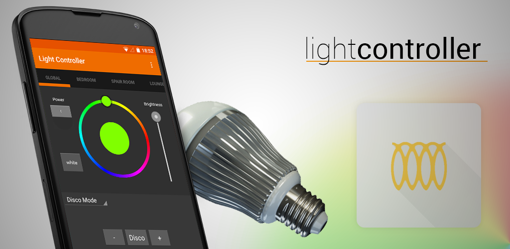
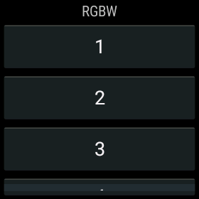

Light Controller
================

Adding in Android wear functionality. doesnt look very pretty at the moment though

Description
-----------
have you got LED lights, but find yourself using the Lightswitch more often than not because of the need to open the app in order to simply turn on the lights? this app if you, it was developed specifically in order to give you the light switches where they are most accessible. you choose where you want the switches, be it on one of your home screens, on the lock screen or both.

The widget gives you easy access to switch each zone on and off as well as global control. also included is easy access to the main application for more advanced control.

We have started working on some extra lighting modes also light listening mode, where it will attempt to detect the beat of the music playing and pulse different colours to the music. A candle mode to emulate the flickering of a candle, along with the built in disco modes.

Control LED Bulbs from:
* Easybulb
* Limitless LED
* MiLight
* AppLamp
* ilux

and some others also.

You will need the Wifi Controller box to access these lights from the application

if the application doesn't work out of the box, you may need to setup the IP address of your controller box, by default the application will attempt to broadcast to the whole network, this does not work in all setups.

This Project is Open source, find the source on GitHub here:
https://github.com/eliotstocker/Light-Controller
Pull request and translations very welcome

Change Log
----------
[Changes can be found here](changelog.md)

License
-------
Light Controller is published under the [GPL V3 license](GPL.md)

Libraies
--------
Light controller uses the following libraries:
* [HoloColorPicker](https://github.com/LarsWerkman/HoloColorPicker) by [Lars Werkman](https://github.com/LarsWerkman)
* [Android PagerSlidingTabStrip](https://github.com/astuetz/PagerSlidingTabStrip) by [Andreas Stütz](https://github.com/astuetz)
* [Material Dialogs](https://github.com/afollestad/material-dialogs) by [Aidan Follestad](https://github.com/afollestad)
* [Appcompat Android Support](https://developer.android.com/tools/support-library/features.html) by [Google](https://developer.android.com/)
